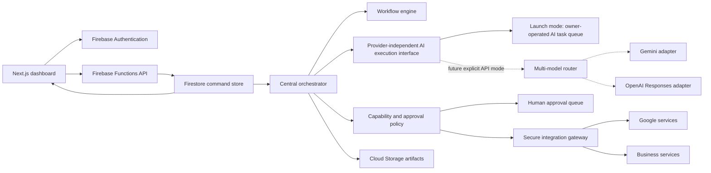

# PageLoom OS architecture — Master Knowledge Map

> **Maintenance policy.** This document is the single source of truth for PageLoom OS's
> architecture. Whenever a change touches any of the following, update the matching
> section in the same PR: a new app/service/workspace; Firebase config, Security Rules,
> or indexes; workflow stages/events in `packages/core/src/workflow.ts`; the agent fleet
> in `packages/core/src/agents/`; API endpoints or Cloud Functions in `functions/src/`;
> the deployment/CI pipeline; or the AI execution-mode/model-routing logic. Update the
> **Last full audit** line below whenever a section is re-verified against source.
>
> **Last full audit:** 2026-09-16, against `main` @ `dff6221` (full read-only pass over
> every application, Firebase service, security rule, deployment flow, AI component, and
> business workflow in the repository). **Revised same day** after a completeness review
> added §12 (Company operating docs), expanded the API surface (§4), domain modules
> (§5), frontend components (§3), and operations (§11) sections, and added a Support
> workflow subsection (§10) that the first pass had dropped. **Revised again same day**
> (§10) noting Business Discovery's standalone-module decision — see that section's
> amendment note for the summary and `docs/customer-discovery-onboarding/*.md` for full
> detail.

PageLoom is a multi-tenant, event-driven agency control plane. The dashboard never
invokes models or third-party services directly. Authenticated commands enter the
Functions API, become Firestore work records, and are claimed transactionally by the
central orchestrator. A human — the organization Owner, acting as CEO — closes every
sale and approves every protected action; the 22-agent fleet does the work in between.



**System DNA:** 3 workspaces · 22 AI agents · 24 workflow stages · 30 workflow events ·
40+ Firestore collections · ~50 API endpoints · 18 external integrations · 2 AI
execution modes.

---

## 1. Runtime boundaries

- `@pageloom/core` (`packages/core`) — provider-neutral schemas, all 22 versioned
  single-responsibility agent contracts, both customer-journey/workflow state machines,
  and deterministic routing/pricing/finance/legal policy.
- `@pageloom/functions` (`functions`) — owns credentials, authorization, orchestration,
  external side effects, audit records, usage accounting, webhooks, and schedules.
- `@pageloom/web` (`apps/web`) — a static Next.js application. It reads authorized live
  projections from Firestore and sends mutations only through the API.
- Firestore stores organization-scoped commands and projections. Cloud Storage stores
  generated artifacts. Security Rules make browser data effectively read-only — **every
  Firestore and Storage write rule is `if false`**; all mutation flows through the
  Admin SDK inside a Functions handler.

### Governing invariants

- **Human-first sales.** No agent calls, messages, or closes a prospect — only the Owner
  can create a project, and the request must carry a CRM lead ID plus close evidence
  (`dealClosedAt`). Both the API and orchestrator reject project/AI work without it.
- **Single execution authority.** Only the Central Orchestrator executes tools or spawns
  child agent tasks; the 22 agents never call each other directly.
- **Provider-independent AI.** Launch mode is *manual*: the orchestrator assembles a task
  package and the Owner runs it in ChatGPT/AI Studio, pasting back a validated JSON
  result. Live model calls stay dormant behind a two-variable production gate (§9).

---

## 2. Codebase map

| Path | What lives here |
|---|---|
| `apps/web` | Bilingual (he/en) Next.js 16 / React 19 control-plane dashboard — staff dashboard, sales/CRM, project workspace, customer portal, master admin panel, discovery wizard. |
| `functions` | Firebase Functions: the Express API, orchestrator, workflow engine, 14 feature routers (enterprise, document, command-center, business-intelligence, fleet, report, operational-records, platform-master, closing, website-content, customer-admin, onboarding-journey, discovery, staff-admin), backup/watchdog jobs, scheduled triggers. 40 source modules, each with a co-located test. |
| `packages/core` | Shared, provider-neutral domain package: 22 agent definitions, both stage machines, pricing/finance/legal/localization logic, discovery template — 35 modules total. |
| `automation` | The Autonomous Development Manager toolchain — task classification, dispatch, QA-review requests, merge-eligibility checks, status-board rendering. |
| `scripts/backup-verification` | Read-only backup/DR freshness checkers plus a production-guarded Firestore restore-drill script. |
| `scripts/golden-*-rehearsal.mjs` | Manual, local-only scripts that rehearse the entire customer lifecycle against live production using fictional, tagged data. |
| `docs` | ~35 architecture, security, operations, launch-readiness, and sprint documents, plus `company/`, `customer-journey/`, `customer-discovery-onboarding/`, and `mfa-app-check/` subtrees. |
| `workflows/customer-journey.v1.json` | The declarative top-level 13-stage pipeline policy (human-first sales, CEO authority, no customer↔AI contact). |
| `templates`, `prompts` | The post-close customer-questionnaire JSON Schema, and a prompt-governance policy note (agent prompts live in code, not here). |
| `firebase.json`, `*.rules`, `*.indexes.json` | Hosting, Functions, Firestore, and Storage configuration and security rules — see §6–7. |

---

## 3. Frontend — `apps/web`

A Hebrew-first, RTL-default Next.js App Router application, statically exported and
served by Firebase Hosting.

### Route map

**Two separate applications share this Next.js build, each with its own layout/shell — see
the 2026-09-18 amendment in §10 for why. The Owner Workspace (`(product)` route group,
`product-shell.tsx`) is daily business operations; Backend Master (`(master)` route group,
`master-shell.tsx`) is platform administration only. Neither's nav links to the other.**

| Route | Access | Purpose |
|---|---|---|
| `/dashboard` | Owner Workspace · Staff | Revenue / pipeline / AI-cost tiles (privileged roles), today's activity, pending approvals, deployments, notifications. |
| `/crm` | Owner Workspace · Staff | "Customers" in the sidebar. Lead kanban (new→won/lost) and customer records with contacts/documents. |
| `/discoveries` | Owner Workspace · Staff | "Discovery" in the sidebar. Every submitted Discovery org-wide, searchable/filterable, with actions to open the questionnaire or convert an orphan project to a customer. |
| `/projects`, `/projects/view` | Owner Workspace · Staff | "Websites" in the sidebar. Project list and a tabbed workspace: onboarding (Discovery), questionnaire, website, tasks, approvals, files, history. `/projects/view` reads an initial `?tab=` param. |
| `/agents` | Owner Workspace · Staff | "AI" in the sidebar. The 22-agent roster — status, assign-a-job, pause/resume, execution log. |
| `/billing` | Owner Workspace · Staff (owner/admin) | Customers/invoices/payments org-wide; can create invoices and record payments. Subscriptions has no backing concept yet — an honest empty state, not fabricated data. |
| `/settings` | Any signed-in user | MFA enrollment, appearance/theme settings. |
| `/sales`, `/portal` | Owner Workspace · reachable via a secondary "More" link, not a primary sidebar section | Sales: lead metrics, AI-assisted outreach & proposal drafting, embeds the human-only `ClosingWorkspace`. Portal: the customer's own journey/Discovery/file-upload/handover/support view (staff can preview it). |
| `/builder` | Owner Workspace · Staff | Pre-sale intake → schedule a call; separate closed-won recorder enforcing the human-close requirement; production pipeline view. |
| `/discovery` | Customer | Standalone (no sidebar) 9-section Business Discovery wizard — deliberately separate UX context. Since 2026-09-17, the UI is the imported AI Studio frontend (`apps/web/src/ai-studio/App.tsx`); see §10's amendment. |
| `/master`, `/master/content`, `/master/customer` | **Backend Master** · Owner / Admin only | Its own `(master)` layout/shell (no Owner Workspace sidebar). Master Control Center, cross-project content editor, full admin customer profile with portal-user management. |

### Data layer

- **Reads:** `lib/live-data.ts`'s `useLiveCollection()` opens a real-time Firestore
  `onSnapshot` query directly from the browser — the sole live-read path, gated entirely
  by Security Rules.
- **Writes:** `lib/api.ts`'s `api()` helper attaches the Firebase ID token and calls
  `/api/*` — the sole mutation path. No client code writes to Firestore directly.
- **Auth:** `lib/auth.tsx` — Google popup sign-in, MFA-challenge interception for
  TOTP-required accounts.
- **Org context:** `lib/organization.tsx` loads `GET /me` for the caller's
  memberships/roles.

### Key components

- **Shell/framework:** `product-shell.tsx` — the **Owner Workspace** shell only (auth gate,
  org switcher, the 7-section role-based nav, live health-pill polling); `master-shell.tsx`
  — the separate **Backend Master** shell (auth gate + owner/admin gate, minimal distinct
  chrome, no shared nav with product-shell.tsx — see §10's 2026-09-18 amendment); both reuse
  `AuthenticatedOrganization` (also in `product-shell.tsx`) for the auth/org context they both
  still need. Plus `role-scoped-extras.tsx` (injects role/route-conditional widgets, Owner
  Workspace only), `route-error-boundary.tsx`, `sign-in.tsx`, `mfa-challenge.tsx`.
- **Dashboard/business widgets:** `business-intelligence-overview.tsx`,
  `enterprise-overview.tsx`, `fleet-overview.tsx`, `reports-overview.tsx`,
  `operational-records.tsx`, `operations-health-card.tsx`, `notification-inbox.tsx`,
  `customer-journey-timeline.tsx`, `workflow-timeline.tsx`.
- **Sales/closing:** `closing-workspace.tsx` — the human-only deal-close UI embedded in
  `/sales`.
- **Agents/AI:** `agent-governance.tsx`, `manual-ai-queue.tsx` — the manual-mode AI task
  queue UI.
- **Discovery:** `discovery-panel.tsx`, `discovery/DiscoveryStepper.tsx`,
  `discovery/DiscoverySection.tsx`, `discovery/DiscoveryScreens.tsx`.
- **Content/portal admin:** `document-center.tsx`, `website-content-workspace.tsx`,
  `content-approval-center.tsx`, `customer-portal-access.tsx`,
  `portal-access-center.tsx`, `portal-user-manager.tsx`.
- **Support/legal/master:** `support-center.tsx`, `master-support-center.tsx`,
  `legal-center.tsx`, `master-control-center.tsx`.
- **Account/team:** `account-security.tsx` (MFA enroll/unenroll), `team-access.tsx`.

### i18n / RTL system

Hebrew (`he`) is the default locale and is hardcoded at the HTML root
(`dir="rtl" lang="he"`). English dictionaries already exist alongside Hebrew in every one
of the ~50 namespaces under `lib/i18n/dictionaries/`, ready for a future live locale
switcher that isn't built yet. Components use Tailwind logical properties (`ps-`, `pe-`,
`start`) instead of left/right so the app mirrors correctly.

### Build pipeline detail

Production builds use `output:"export"` — a fully static site. `generateBuildId` is
pinned to the git commit hash specifically so the export is byte-for-byte reproducible,
because `scripts/sync-csp.mjs` hashes inline script content into the Content-Security-
Policy allowlist in `firebase.json` — a random build ID would invalidate that hash on
every rebuild with zero source changes (documented root cause of a prior
CSP-blocked-hydration incident).

---

## 4. Backend — Firebase Functions

One Express app plus nine background triggers, all defined from a single 40-module
source tree.

### Deployed functions (`functions/src/index.ts`)

| Function | Trigger | Role |
|---|---|---|
| `api` | HTTPS (public invoker) | The Express app — every `/api/**` route. |
| `executeAgentTask` | Firestore create on `tasks/{taskId}` | Routes to orchestrator `prepareManual` or `run` based on the resolved AI execution mode. |
| `processWorkflowEvent` | Firestore create on `workflowEvents/{id}` | WorkflowEngine's state-machine transition. |
| `initializeProjectWorkflow` | Firestore create on `projects/{id}` | Creates the `workflowInstances` doc, emits `LeadCreated`/`LeadWon`. |
| `handleWorkflowTaskResult` | Firestore update on tasks | Emits `AgentTaskFailed` or the stage's completion event once every required agent finishes. |
| `monitorWorkflowTimeouts` | Schedule · every 10 min | Scans for timed-out workflow instances, emits `StageTimedOut`. |
| `recoverAgentQueue` | Schedule · every 5 min | Retries or dead-letters stale/failed tasks. |
| `dailyFirestoreBackup` | Schedule · 02:30 Asia/Jerusalem | Exports Firestore to Cloud Storage via a dedicated backup service account. |
| `monitorBusinessRisks` | Schedule · hourly | Evaluates domain/SSL/backup/inactivity/profitability alerts. |
| `backupFreshnessWatchdog` | Schedule · every 6h | Independent dead-man's-switch check on backup and service health. |
| `dailyCeoReport` | Schedule · 08:00 Asia/Jerusalem | Queues an internal CEO-agent report task per autonomy-enabled org. |

### API surface by subsystem

- **Identity & jobs:** `GET /me`, `POST /jobs`, `POST /tasks/:id/manual-output`,
  `POST /agents/:id/pause`, `POST /chats/:id/messages`
- **Sales close & journey:** `POST /projects` (atomic close), `POST /projects/:id/journey`,
  `POST /clients/start`, `POST /projects/:id/start`
- **CRM:** `/leads`, `/leads/:id/notes`, `/customers`, `/customers/:id/contacts`,
  `/customers/:id/documents`, `/customers/:id/invitations`
- **Intake:** legacy `/client-projects`, `/questionnaires`; current full Discovery router
  (see §10)
- **Workflow & approvals:** `POST /workflow/events`, `POST /approvals/:id/decision`,
  `POST /projects/:id/assets/validate`
- **Dashboards:** `GET /dashboard/:orgId`, `GET /operations/:orgId/health`,
  business-intelligence / command-center / platform-master aggregate routers
- **Content & documents:** website-content draft/preview/publish/rollback,
  document/report generation (`document-api.ts`, `document-renderer.ts`,
  `report-api.ts` — PDF + CSV, SHA-256 integrity-hashed, Hebrew RTL bidi PDF text)
- **Staff & platform administration:** `staff-admin-api.ts` (`POST /staff/invite`,
  `PATCH /staff/:uid`, `POST /staff/:uid/mfa-reset` — owner-only, never self),
  `customer-admin-api.ts` (`GET/PATCH /admin/customers/:id`, portal-user
  disable/reassign/password-reset), `platform-master-api.ts`
  (`GET /platform/master` — cross-org rollup, `GET /platform/support-tickets`)
- **Legal, pricing & provisioning:** `enterprise-api.ts` — legal document
  versioning/publish/acceptance (Hebrew-only, SHA-256-hashed), pricing quotes/packages,
  revenue/expense ledger entries, project-factory provisioning-plan requests
  (`dry_run` only, requires CEO approval)
- **Sales closing workspace:** `closing-api.ts` — proposal creation, digital contract
  signature, payment-marked-paid, onboarding checklist toggling
- **Finance & support operations:** `operational-records-api.ts` — financial ledger
  entries, staff/portal support tickets (separately rate-limited), notification
  read/read-all, per-agent governance settings (`PUT /agent-settings/:agentId`)
- **Fleet health:** `GET /fleet/:orgId`, `POST /fleet/:resourceId/actions` — creates an
  approval, never executes directly (`executed:false`)
- **Public:** `GET /public/organizations/:orgId/websites/:id/content` — the only
  unauthenticated route, IP rate-limited, edge-cacheable

### Auth, MFA & App Check

`authenticate` verifies the Firebase ID token (revocation-checked). Every privileged
route runs through one of four chokepoints — `requireRole`, `requireCeo`,
`requirePlatformAdmin`, `requireProjectAccess` — each finishing with an MFA gate keyed
off `MFA_ENFORCEMENT_MODE` (`off` / `optional` / `required`, staged rollout, Owner/Admin
roles only). App Check verification (`monitorAppCheck`) is deliberately
**monitoring-only**: it logs missing/invalid tokens but never rejects a request.

### Rate limiting

A Firestore-backed, transactional fixed-window limiter that **fails open** on infra
errors. Named limits include `ai-job-assign` (30/10min), `ai-manual-output` (30/10min),
`invitation-create` (20/hr), `discovery-autosave` (180/5min), `support-ticket-portal`
(10/15min), and `public-content` (60/min, IP-keyed).

### Tool gateway & tool policy

A static policy table (`tool-policy.ts`) maps every `(tool, operation, agent)` triple to
an approval level — `always`, `writes`-if-side-effecting, or `never` — across 20 tool
families (Gmail, Calendar, Drive/Docs/Sheets, Analytics, Search Console, Business
Profile, Tag Manager, Maps, WhatsApp, Resend, Twilio, CRM, Stripe, PayPal, n8n, Make,
GitHub, GCP, Storage, Firestore). `ToolGateway.execute()` Zod-validates parameters,
checks for an approved `approvals` doc when required, claims an idempotency key
transactionally, then dispatches to the real connector. Lookups for an unmapped triple
throw — deny by default.

### Orchestrator & workflow engine

**CentralOrchestrator** has two paths: `prepareManual` (packages a prompt for the Owner
to run externally, no model call) and `run` (API mode — checks per-agent
concurrency/budget governance, org-wide AI budget, routes to a provider, executes,
records cost). Both converge on the same completion logic: validate the typed
`AgentOutput`, verify required deliverables for the stage, persist artifacts/deployment
records/questionnaires, process any `ActionRequest`s through the Tool Gateway, and
delegate bounded child tasks (max depth 4, max 12 per output).

**WorkflowEngine** is the sole component allowed to advance pipeline state. `process()`
runs entirely inside one Firestore transaction: resolves the event's valid transition,
checks entry-condition facts and retry budgets, updates the workflow instance + project
projection + history + logs, creates an approval doc if the stage requires one, creates
exactly one task per required agent, and fans out notifications.

### Backup, watchdog & queue recovery

`exportFirestoreBackup` calls the Firestore Admin REST export API directly.
`runBackupFreshnessWatchdog` runs three independent, individually try/caught checks
every 6 hours: Firestore export freshness (27h threshold, using real object
`timeCreated` to dodge DST edge cases), Storage Transfer freshness (204h/8.5-day
threshold), and Google's Personalized Service Health API. `QueueRecovery.scan()` (every
5 min) retries or dead-letters stale/failed tasks; exhausted retries land in
`deadLetters/{taskId}`, retryable only by an Owner.

---

## 5. Shared domain — `packages/core`

The provider-neutral contract layer: agent definitions, both stage machines, and every
deterministic business rule.

### The 22-agent fleet

Every agent carries `inputs/outputs/workflow/tools/approvalRequiredFor` and a shared
policy clause appended to every system prompt — *operate only through the central
orchestrator; never contact a customer directly; money, pricing, publication, production
deployment, and destructive actions require explicit CEO approval.* Every agent is
hard-pinned `preferredProvider:"gemini"`, `fallbackProvider:"openai"` at construction.

| # | Agent | Role | Cannot do |
|---|---|---|---|
| 1 | CEO | Priorities, KPIs, conflict resolution, protected-action approval | Impersonate the human CEO / claim a call occurred |
| 2 | Sales | Lead research, qualification, proposal drafts, pipeline tracking | Contact or close a customer |
| 3 | Client Journey | Post-close questionnaire issuance, asset collection, checkpoints | Start before a verified human close |
| 4 | Project Manager | Scope decomposition, ownership, deadlines, delivery risk | — |
| 5 | Website Architect | Routes, data flows, integration contracts, ADRs | Implement product code |
| 6 | UI/UX Designer | Journeys, wireframes, design tokens, WCAG 2.2 AA | — |
| 7 | Frontend Builder | Next.js/React/Tailwind implementation, RTL, perf | Change backend contracts / prod infra |
| 8 | Backend | Server logic, API contracts, authZ, idempotency | — |
| 9 | Firebase | Firestore modeling, Auth, Security Rules, Storage/Hosting | Weaken rules to ship a feature |
| 10 | SEO | Keyword research, technical audits, on-page specs | Invent rank/traffic evidence |
| 11 | Content | Bilingual copy, claim validation | Ship unsupported claims |
| 12 | Brand | Positioning, identity system, voice | Produce page UI/copy/media |
| 13 | Media | Asset planning, art direction, rights/provenance | — |
| 14 | QA | Test strategy, regression, abuse paths, release recommendation | Approve from descriptions alone |
| 15 | Deployment | Release-gate validation, builds, promotion, rollback | Deploy without a passed QA gate + CEO approval |
| 16 | Maintenance | Reliability, dependency review, patch planning | — |
| 17 | Support | Post-sale triage, resolution planning, SLA tracking | Send responses / pose as the customer contact |
| 18 | Marketing | Demand-gen strategy, campaigns, measurement | Send customer outreach |
| 19 | Finance | Pricing analysis, invoice drafts, margin/forecast | Charge, refund, or change pricing itself |
| 20 | Analytics | Measurement plans, event taxonomy, KPI reporting | Report anything but observed data |
| 21 | Automation | Cross-system workflow design, idempotency, runbooks | — |
| 22 | CRM | Lead/deal/customer record integrity, dedup | Mark a deal closed without a human close event |

### Two parallel stage vocabularies

The domain runs two coexisting, non-derived-from-each-other state machines — worth
understanding before touching either:

- **`JourneyStage` (13 stages, `customer-journey.ts`)** — a coarse customer-journey
  progression used for dashboards and reporting. Linear only —
  `assertJourneyTransition` rejects any skip.
- **`WorkflowStage` (24 stages, `workflow.ts`)** — the authoritative, fine-grained
  production pipeline that actually drives agent task creation — see §10 for the full
  track.

### Other domain modules

- **Pricing & finance:** quote calculation, executive finance rollups (MRR/ARR/CLV),
  business-intelligence aggregates.
- **Business rules (v1, effective 2026-08-16):** 2 included revision rounds, 0%
  self-authorized discount (enforced as a schema invariant, not just a default), 60%
  target gross margin, 90-day backup retention, 24h RPO / 4h RTO.
- **Legal:** versioned, content-hashed, Hebrew-only legal documents; acceptance records
  bind type + version + hash + effective date.
- **Israel localization:** Hebrew/RTL customer defaults, 9-digit business IDs,
  VAT-in-basis-points invoice math in integer agorot, five hardcoded Hebrew
  customer-message templates.
- **Discovery template:** the 9-section, ~50-question Business Discovery schema
  (see §10) with a `BusinessProfileDocument` type scaffolded but unused — the future
  AI-synthesis step isn't wired up yet.
- **Project factory:** a 12-stage dependency-DAG provisioning *plan* builder for
  dedicated customer infrastructure — hardcoded to `dry_run`; it never actually calls
  GCP.
- **Budget/concurrency governance (`budget.ts`):** three pure gate functions — org AI
  budget, per-agent concurrency cap, per-agent daily spend cap. Consumed by
  `functions/src/cost.ts` (usage/cost recording) and the orchestrator's `run()` path.
- **Fleet & operations health (`fleet.ts`, `operations-health.ts`):** infrastructure
  health aggregation (hosting/Firestore/Storage/backup/monitoring status per customer
  resource) and a weighted-penalty operational health scorer (failed tasks, stale
  queues, blocked/timed-out workflows, overdue approvals, unpriced usage).
- **Customer journey timing (`customer-experience.ts`):** `measureCustomerJourney()` —
  7 named timing spans (lead→proposal→questionnaire→website→review→deployment→delivery)
  derived from the same `WorkflowEventType` vocabulary as `workflow.ts`.
- **Handover & revision requests (`handover.ts`, `revision-requests.ts`):** a durable
  post-launch record (live URL, support/maintenance instructions, responsibility split)
  and a structured replacement for ad hoc revision-tracking, complementary to the
  workflow engine's `CustomerRequestedRevision` event.
- **General document engine (`documents.ts`):** a broader templated-document system
  than `legal.ts` (13 document types, locale-configurable, mustache-style rendering,
  digital-signature binding) — the two coexist rather than one superseding the other.
- **Launch checklist & website brief (`launch-checklist.ts`, `website-brief.ts`):** a
  13-item pre-publish visibility checklist (not itself an authorization gate — the real
  gates are the workflow engine's approval stages) and the legacy 22-field intake form
  reusing the generic questionnaire mechanism (see §10).
- **Agency day window & MFA policy (`agency-day-window.ts`, `mfa-policy.ts`):**
  timezone-aware (DST-safe) "today" boundary calculation for the daily CEO report and
  business-automation scans, and the shared, dependency-free staged-MFA policy consumed
  by both `functions/src/auth.ts` and the web app's enrollment UI.

---

## 6. Firebase integration

| Service | Configuration |
|---|---|
| Hosting | Serves the static export `apps/web/out`. `/api/**` rewrites to the `api` function (region `europe-west1`, `pinTag:true`); catch-all rewrite to `/index.html`. Global headers include HSTS, `X-Content-Type-Options`, and a strict CSP with per-script SHA-256 hashes (no `unsafe-inline`/`unsafe-eval`). |
| Functions | Single codebase, `nodejs22` runtime. Predeploy chain builds `core` → `functions` vendor prep → `functions`. |
| Firestore | Rules in `firestore.rules`; 8 composite indexes (below) plus 3 collection-group field-override indexes for cross-org email lookups. |
| Storage | Single default bucket; rules in `storage.rules`, mirroring the Firestore role model via `firestore.get()` cross-service calls. |
| Auth | Google OAuth sign-in; staged TOTP multi-factor for Owner/Admin (Identity Platform required, not yet Console-enabled). |
| App Check | ReCaptchaV3, monitoring-only — see §7. |
| Emulators | Auth 9099 · Functions 5001 · Firestore 8080 · Hosting 5000 · Storage 9199 · PubSub 8085. |

### Firestore composite indexes

- `tasks`: status+updatedAt, agentId+updatedAt
- `projects`: status+updatedAt, journeyStage+updatedAt, customerId+updatedAt
- `usage`: provider+createdAt
- `workflowInstances` (collection group): status+timeoutAt — powers the 10-minute
  timeout sweep
- `supportTickets`: customerId+updatedAt

---

## 7. Security rules

Deny-by-default everywhere. **Every Firestore and Storage write rule is `if false`** —
every mutation runs through the Admin SDK inside a Functions handler.

### Role primitives

`platformAdmin()` (custom claim `owner`/`admin`) → `staff(orgId)` (any member role) →
`privileged(orgId)` (owner/admin/operator, excludes plain `member`) → `client(orgId)`
(role `client`, scoped to their own `customerId` and, if set, a `projectIds`
allow-list).

### Firestore access tiers

| Tier | Read gate | Collections |
|---|---|---|
| Privileged-only | owner/admin/operator | `revenue`, `expenses`, `agentSettings`, `infrastructurePlans`, `backupRuns`, `domains`, `certificates`, `fleetResources`, `incidents`, `alerts`, `securityEvents`, `deadLetters`, `executions`, `apiKeys`, `secrets`, `auditLogs`, `scheduledJobs`, `maintenanceRequests`, `reviews`, `pricingPackages`, `legalDocuments`, `staffInvitations` |
| Staff-broad | any staff role incl. member | `leads`, `customers`, `tasks`, `approvals`, `usage`, `metrics`, `communicationDrafts`, `deployments`, `builds`, `activity`, `journeyEvents`, `workflowInstances`/`Events`/`History`/`Logs`, `notifications`, `calendarEvents`, `customerInvitations`, `documentTemplates`, `reports`, `websites`, `templates` |
| Staff or client | staff, or matching client scope | `projects`, `comments`, `questionnaires`, `revisionRequests`, `handover`, `supportTickets`, `discovery`/`discoveryProgress` |
| Staff-only (deliberate) | staff, no client clause at all | `discoveryNotes`, `businessProfile` — the enforcement point for "customer must never see internal notes" |

> **Confirmed by test:** `systemAdministrators` is not matched by any rule and is denied
> to everyone — including platform admins — reachable only via the Admin SDK. A
> catch-all `match /{document=**} { allow read, write: if false }` closes everything
> else.

### Storage rules

A parallel role model reads Firestore membership via cross-service calls. Global upload
guardrail: <25MB and an allow-listed content type. Website-media uploads additionally
cap at 15MB and restrict to `image/jpeg|png|webp|gif` / `video/mp4|webm`. Every path
pattern is either staff-or-scoped-client for reads and same-uid + shape-checked for
writes; the catch-all denies everything else.

### MFA & App Check — staged rollout

Both ship **inert by default**. A single env var each — `MFA_ENFORCEMENT_MODE` and the
App Check site key — controls a three-stage rollout: (1) App Check monitoring only,
watch Console metrics for days; (2) MFA `optional`, confirm every Owner/Admin has
enrolled; (3) MFA `required`, flips 403 enforcement on. Every stage is reversible by
unsetting one env var, with no data migration.

---

## 8. Deployment & CI/CD

### npm scripts

```text
build       core build → functions vendor-prep → functions build → web build
typecheck   core build → functions vendor-prep → functions typecheck → web typecheck
test        core → functions vendor-prep → core/functions/web tests → automation → backup-tooling
check       typecheck && test && build
deploy          npm run build && firebase deploy --only hosting,functions,firestore,storage
deploy:hosting  build web only && firebase deploy --only hosting
```

> **Deploy gate.** No CI workflow ever runs `firebase deploy`. Deployment is exclusively
> manual and human-run — the repository's own `CLAUDE.md` requires fresh, current-turn,
> scope-specific approval before either `deploy` script executes.

### GitHub Actions

| Workflow | Trigger | Role |
|---|---|---|
| `ci.yml` | push/PR to main | Typecheck, lint, unit tests, behavioral rules tests against a real Firestore emulator, and a full E2E customer-lifecycle test against an isolated `demo-` project. No deploy step. |
| `claude.yml` | @claude mentions, issue open/assign | The single execution path that runs Claude Code against the repo; reused by both humans and the autonomous manager. |
| `claude-code-review.yml` | PR opened/updated | Automatic inline code review on every PR. |
| `autonomous-manager.yml` | Every 30 min + issue/PR close | Dispatches approved work, requests independent QA review, checks merge eligibility, updates a live status-board issue. **Never merges a PR.** |

### Autonomous Development Manager

Lets Owner-approved GitHub issues get implemented unattended, inside a fail-closed
classification policy (`automation/policy.json`, `automation/lib/classify.mjs`):

1. `autonomous:protected` label → PROTECTED, always.
2. Any of 6 hard keyword categories (money, firebase-cloud-production, secrets,
   production-infrastructure, customer data, destructive) → PROTECTED — cannot be
   overridden by any label.
3. Not labeled `autonomous:approved` → PROTECTED.
4. Matches a SAFE category (bug-fix, tests, docs, CI fix, etc.) or has
   `autonomous:safe` → SAFE.
5. Unknown → PROTECTED by default.

- **Roles:** Developer (default), QA & Safety (independently reviews every PR — never
  the same session as the author), Business & Ops (internal docs/templates only).
- **Merge eligibility** is only ever *labeled* (`autonomous:ready-for-merge`) — no
  script in the toolchain calls `gh pr merge`. A human merges by hand, always.
- **Concurrency:** max 2 workers, fails closed to zero new dispatch if any in-progress
  issue is blocked.

### Backup verification & rehearsal tooling

`scripts/backup-verification/` ships read-only freshness checks plus a restore-drill
script whose production-target guard is enforced at four independent layers (CLI-arg
check, per-command-builder re-check, API-resolved-identity re-check, case/whitespace-
insensitive rejection). By contrast, `scripts/golden-*-rehearsal.mjs` genuinely writes
to live production using clearly-tagged fictional customer data, authenticating as the
real Owner via the local Firebase CLI session — these are manual, local-only tools with
no CI/cron wiring, and their safety rests on process (fictional data + the product's
own human-approval gates), not a code-level guard.

---

## 9. AI components

### Execution-mode gating

`resolveAiExecutionMode()` fails safe to `manual` on anything missing, ambiguous, or
unrecognized. Outside production, `api` mode is free to use (local/emulator dev). In
production, `api` mode additionally requires a second env var,
`AI_EXECUTION_MODE_APPROVAL`, to exactly equal a fixed sentinel string — two independent
variables must agree before any live model billing turns on.

- **Manual mode (launch default):** orchestrator assembles context + instructions +
  required deliverables + a strict output contract, flips the task to
  `awaiting_manual_ai`. The Owner runs the package in ChatGPT/AI Studio and pastes back
  JSON. No model API is ever called.
- **API mode (dormant):** routes to OpenAI (Responses API, strict JSON schema, hashed
  `safety_identifier`) or Gemini, with governed concurrency, daily budget, and org-wide
  AI-spend checks run *before* any inference call.

### Model routing & budget

`routeModel()` picks the agent's preferred provider if healthy, else falls back —
throwing if neither is. Fallback itself is gated by `OPENAI_FALLBACK_ENABLED`. Budget
checks stack three independent gates: org-wide AI spend limit, per-agent concurrency
cap, per-agent daily spend cap — any of which routes work to `awaiting_approval` rather
than silently proceeding.

### Prompt governance

Agent prompts live version-controlled in `packages/core/src/agents`, not as standalone
template files. Prompt changes follow the same review path as code; the stated
production intent is to move stable prompt prefixes to provider-hosted reusable prompts
with recorded versions per task.

---

## 10. Business workflow, end to end

Three human-owned gates open the pipeline, five automated agent stages run it, another
human gate approves it, and two automated stages keep it running.

### The 24-stage production pipeline

| # | Stage | Owner |
|---|---|---|
| 1 | lead | **human** |
| 2 | phone_call | **human** |
| 3 | closed_won | **human** |
| 4 | payment_confirmed | **human** |
| 5 | onboarding | auto |
| 6 | questionnaire | auto |
| 7 | assets | auto |
| 8 | research | auto |
| 9 | brand_strategy | auto |
| 10 | design_system | auto |
| 11 | sitemap | auto |
| 12 | ux_planning | auto |
| 13 | ui_generation | auto |
| 14 | copywriting | auto |
| 15 | seo_optimization | auto |
| 16 | development | auto |
| 17 | deployment_preparation | auto |
| 18 | qa | auto |
| 19 | ceo_approval | **human** |
| 20 | production_deployment | **human** |
| 21 | customer_review | **human** |
| 22 | revision | auto |
| 23 | final_deployment | **human** |
| 24 | completed | auto |

Loop-back edges exist by design: `QAFailed` sends `qa` back to `development`;
`CEORejected` sends approval stages back to `revision`; `AssetsMissing` is a universal
rollback-to-`assets` escape hatch from any of 12 downstream stages; `RevisionCompleted`
returns to `ceo_approval` for re-review rather than redeploying directly.

### Sales & closing

Policy is explicit in `workflows/customer-journey.v1.json`: `sales:"human-first"`,
`dealCloseAuthority:"ceo"`, `customerAiInteraction:false`. A lead is recorded, the Owner
runs the sales call by phone, and Closed Won is a manual Owner transition.
`dealClosedAt` plus a CRM lead ID are the atomic evidence pair the API and orchestrator
both require before any project or AI work is allowed. Payment confirmation
(`payment_confirmed`) is likewise a deliberately manual, Owner-only action — Stripe
webhooks record payment state only and never auto-advance the workflow.

### Two coexisting intake systems

- **Website Brief (legacy default)** — a flat 22-field questionnaire, auto-created at
  payment confirmation, filled in one sitting via the generic questionnaire mechanism.
- **Business Discovery (current primary)** — a 9-section, ~50-question, Hebrew-first,
  autosaving wizard (business → customers → services → differentiation → trust →
  branding → materials → presence → goals). Every question carries a `semanticTag` for
  a future AI-synthesis step that isn't built yet. Internal reviewer notes
  (`discoveryNotes`) are never client-readable — the single most safety-critical rule
  in the feature.

Both emit the same `QuestionnaireCompleted` event, so every downstream stage is
unaffected by which one ran.

> **Amendment (2026-09-16): Business Discovery is now a standalone module.** By explicit
> decision, Discovery must not reference, depend on, or modify CRM/sales-pipeline code
> (leads, deals, proposals, invoices, the `customers` collection) — it connects only to the
> Customer Portal, the Backend Master Panel, Firestore, and Storage. The one coupling that
> existed — `/discovery/submit` requiring `project.dealClosedAt` — was removed
> (`functions/src/discovery-api.ts`); `requireProjectAccess` role/tenant authorization is
> unaffected. Discovery status is now also visible in the Master Panel's top-level customer
> table, not only per-project. See `docs/customer-discovery-onboarding/ARCHITECTURE.md`'s own
> amendment note for the full detail.

> **Amendment (2026-09-17): the customer-facing `/discovery` UI is now the Google AI Studio
> frontend** (`apps/web/src/ai-studio/**`, imported from `Iantebi/pageloom-discovery-ai`),
> replacing the previous hand-built stepper UI — the backend, Firestore structure, security
> rules, and authentication are unchanged; there is exactly one Discovery data path. The AI
> Studio app's own data layer (`services/firebaseDiscoveryService.ts`) no longer talks to
> Firestore/Storage directly — it calls the same real backend every other client does
> (`apps/web/src/lib/discovery.ts`), through a field-level bridge
> (`services/discoveryMapping.ts`) that translates its flat `DiscoveryData` shape to/from the
> real per-section `discoveryTemplate` schema. `discovery-template.ts` gained a small set of
> additive optional questions (fields AI Studio collects with no prior home) and several
> required→optional loosenings for questions no AI Studio step asks (they would otherwise
> permanently block `/submit` for this frontend) — nothing existing was removed or renamed.
> A new staff-only endpoint, `GET /discovery/management/sessions`, lists every project's
> Discovery progress for an org; it backs a new Owner Dashboard/Master Panel Discovery list
> (`dashboard-discovery-slot.tsx`, `discovery-management-list.tsx`) that links into the
> existing per-project `DiscoveryPanel`. **Correction (2026-09-17, later same day):** AI
> Studio's own `AdminMaster` view was in fact re-mounted, reachable at `/discovery?view=admin`
> (role-gated to owner/admin), wired to real data via `firebaseDiscoveryService`'s
> `subscribeAllClients`/`subscribeClientDoc` (which call the same management/sessions and
> per-project endpoints above) — it is a second, AI-Studio-native admin surface for Discovery
> specifically, distinct from both the Master Panel's `DiscoveryManagementList` and the new
> `/discoveries` page from the 2026-09-18 amendment below. This duplication (three different
> "list every Discovery" surfaces) is known and not yet consolidated.

> **Amendment (2026-09-18): the Owner Workspace and Backend Master are two separate
> applications; do not merge them.** By explicit decision: the Owner Workspace
> (`(product)` route group, `product-shell.tsx`) is for daily business operations and
> Backend Master (`(master)` route group, `master-shell.tsx`) is for platform
> administration only — each has its own navigation, routes, permissions, layout, and
> responsibilities, and the Owner Workspace must never expose Backend Master controls.
> Concretely: `product-shell.tsx`'s sidebar no longer has a "Master Control" link at all
> (previously shown to owner/admin via `canSeeMaster`); `/master`, `/master/content`, and
> `/master/customer` moved out of the `(product)` route group into their own `(master)`
> route group with its own `layout.tsx`/`MasterShell` (owner/admin gate, a minimal distinct
> top bar, and an explicit one-way "back to Owner Workspace" link — the only connection
> between the two, and it points the allowed direction only). `master-shell.tsx` does not
> render the Owner Workspace's sidebar, `RoleScopedExtras`, or `DashboardDiscoverySlot`.
> `MasterPage` also stopped rendering `DiscoveryManagementList` — tracking submitted
> Discoveries is a daily-operations concern, now served by the Owner Workspace's own
> `/discoveries` (see the previous amendment), not "platform administration."
>
> Same day, separately: the Owner Workspace sidebar itself was unified to exactly the
> seven sections product now specifies — Dashboard, Customers, Discovery, Websites, AI,
> Billing, Settings — reusing existing routes under new labels (`/crm`→Customers,
> `/agents`→AI, `/projects`→Websites) rather than duplicating pages; Sales and the
> client-portal preview moved to a secondary "More" quick-links block. Two sections had no
> dedicated page before this: `/discoveries` (search/filter over the existing
> `GET /discovery/management/sessions`, plus a new
> `POST /admin/discovery-sessions/:projectId/convert-to-customer` for orphan projects) and
> `/billing` (customers/invoices/payments were previously read-only display data with no
> write path at all; new `GET /billing/overview`, `POST /billing/invoices` — finally wiring
> up the previously-unused Israeli VAT calculator in `packages/core`'s
> `israel-localization.ts` — and `POST /billing/invoices/:id/payments`). Subscriptions has
> no backing concept anywhere in this codebase and was deliberately left as an honest
> "not available yet" state rather than fabricated.

### Delivery, review & handoff

The 22-agent fleet works stages 5–18 under the Workflow Engine's control.
`ceo_approval` and `production_deployment` both require an explicit Owner approval
event before the engine will advance — `eventAuthorizesProtectedStage()` in
`packages/core` is the sole choke point gating both. A customer revision loop
(`CustomerRequestedRevision → revision → ceo_approval`) precedes `final_deployment`,
which itself requires a second, separate approval event. `completed` triggers handover:
a durable record splitting PageLoom's ongoing responsibilities from the customer's.

### Customer communication

Five templates ship live in code (onboarding started, questionnaire ready, approval
required, revision received, website published — Hebrew, email + WhatsApp variants). A
further 12 templates exist only as unsent drafts pending Owner approval — rendering a
message is never the same as sending one; the "no AI selling" / human-first policy
applies to every outbound channel.

### Support workflow

Per `docs/SUPPORT-PLAYBOOK.md`: one Owner-managed channel, no autonomous AI replies.
A severity table drives response expectations (recommended, not yet Owner-finalized):
**Critical** (outage, security compromise, destructive data loss, broken lead capture)
→ alert the Owner immediately, preserve evidence, stop any in-flight automation, assess
rollback; **High** → immediate assignment + a recovery-time estimate; **Normal** →
queued; **Change requests** → a separate estimate/approval cycle, never bundled into a
support fix. Support staff must never request passwords or API keys through a ticket.
Both production changes and any rollback made in response to a ticket require the same
explicit Owner approval as any other production action (§8). Tickets are stored in the
`supportTickets` collection (staff-broad + client-own-ticket read access, see §7) and
rate-limited separately for staff (`support-ticket-staff`, 30/15min) versus the
customer portal (`support-ticket-portal`, 10/15min).

---

## 11. Operations & reliability

- **Backups.** Daily Firestore export, 90-day retention, delete protection. Weekly
  incremental Storage Transfer + Object Versioning for media. Secrets are deliberately
  *not* backed up.
- **Restore, verified.** A real drill (2026-08-31) restored 487/487 documents and 17
  subcollections into an isolated temp database, then deleted it — production
  untouched.
- **Targets.** 24-hour RPO, 4-hour RTO. Quarterly restore-drill cadence into isolated
  infrastructure only.
- **Monitoring.** 10 Cloud Monitoring alert policies (backup/storage/scheduler failure,
  function errors, memory, permissions, 5xx, Service Health) plus the independent
  6-hourly watchdog heartbeat.
- **Queue health.** Stale running tasks (>15 min) or unclaimed queued tasks (>30 min)
  are retried or dead-lettered every 5 minutes; only an Owner retries a dead letter.
- **Release gate.** Deploy order: indexes → Firestore rules → Storage rules → Functions
  → Hosting. Release Acceptance Record requires PASS on every automated + human
  acceptance line.

### Disaster-recovery playbooks

`docs/disaster-recovery-runbook.md` covers scenarios beyond backup/restore mechanics:
lost laptop (nothing local is a single point of failure), new-machine setup, corrupted
local git, a bad production deploy (Hosting rollback via `firebase hosting:clone`;
Functions/rules recovered by redeploying the prior commit), accidental Firestore
deletion, corrupted content (in-app `contentRevisions` rollback), lost customer portal
access (reissue via `/master/customer`), Owner account recovery (two independent
platform-Owner Google accounts as break-glass), and an 11-step worst-case full rebuild.
Every scenario ends in a production-changing action, so every recovery step still
routes through the same Owner-approval gate as a routine deploy — a disaster does not
create an approval exception.

---

## 12. Company operating docs

`docs/company/` is the internal, English-language source of truth for how the agency
itself runs — distinct from the customer-facing product docs covered above.

- **README.md** — a functional index (Business/Sales/Marketing/Support/Ops/Legal/
  Finance/Infra/AI/Dev/Customer Success/Templates/SOPs), each area pointing to a
  primary + supporting document.
- **BUSINESS-BLUEPRINT.md** — vision, target market (Israeli SMBs needing Hebrew
  brochure/lead-gen sites), revenue model (fixed-scope setup + recurring hosting/
  maintenance, recognized only from ledger entries), and 7 decision principles
  (customer trust first, reversible-by-default, one authoritative record, never report
  unverified success, automate stable work but keep human gates on external/financial/
  destructive/production actions, Hebrew-default customer comms, typed/tested/
  auditable/rollback-capable production changes).
- **BUSINESS-RULES.md** — the human-readable companion to the executable policy in
  `packages/core/src/business-rules.ts` (§5): Launch policy v1's 2 included revision
  rounds, 0% self-authorized discount, 60% target gross margin, 90-day backup
  retention, 24h RPO / 4h RTO.
- **CEO-HANDBOOK.md** — daily/weekly/monthly/quarterly/annual review cadences and an
  explicit decision framework (state the decision, deadline, reversibility, impact,
  evidence, alternatives, downside, legal/security implications, success measure).
- **FINANCIAL-OPERATING-SYSTEM.md** — pricing formula (labor + infra + support reserve
  + acquisition cost + risk + target margin), zero-authority discounts by default,
  MRR/ARR/CLV/break-even formulas, a monthly close procedure (reconcile → validate →
  review → lock + publish).
- **OPERATIONS-MANUAL.md** — a 16-row workflow table (lead → sales call → proposal →
  contract → closed won → questionnaire → asset collection → project creation →
  production → customer review → deployment → delivery → maintenance → support →
  incident response → offboarding), each row with entry/required-work/exit-evidence.
- **REPORTING-CADENCE.md** — daily/weekly/monthly/quarterly/annual KPI sets, with the
  explicit rule that absent data is reported as *unavailable*, never as zero or green.
- **RISK-REGISTER.md** — 12 scored risks (likelihood × impact); the top three are
  Israeli legal-pack invalidity, scope/revision margin erosion, and founder/key-person
  concentration — each with an owner, a control, and a residual-risk action.

---

## 13. Cross-cutting notes worth remembering

- **The workflow engine has a documented bypass.** The real deal-close endpoint writes
  `journeyStage` directly and never emits engine events — several odd-looking
  entry-condition choices in `workflow.ts` (like `payment_confirmed` having no entry
  conditions) exist specifically to accommodate that gap. Real authorization for
  payment confirmation lives in `onboarding-journey-api.ts`'s explicit `dealClosedAt`
  check, not in the engine.
- **SLA constants are duplicated, not shared.** `operations.ts`'s `supportDueAt` and
  `business-rules.ts`'s `support.*` fields independently encode the same response-time
  targets.
- **No CMS, by design.** Customer message templates and sales-outreach copy are literal
  strings in TypeScript, matching the stated "no CMS or page-builder runtime"
  principle.
- **Two stage vocabularies, never reconciled.** `JourneyStage` (13) and `WorkflowStage`
  (24) both live on `Project` and are not derived from one another — see §5.
- **A scaffolded-but-unused AI layer.** `BusinessProfileDocument` is a fully-typed
  ~30-field schema for AI-synthesized discovery insights; nothing writes to it yet.
- **Assets validation checks a different path than Discovery uploads.** A known,
  deliberately deferred reconciliation between the legacy `assets` workflow stage and
  Discovery's own materials section.
- **The Autonomous Manager's "never approves its own work" rule is process-enforced,
  not identity-enforced** — the QA reviewer runs as a separate session, not a separate
  account.
- **The Stripe webhook handler is a recorded dead end.** `POST /api/webhooks/stripe`
  verifies the signature and idempotently writes `webhookEvents/stripe_{id}` — but
  nothing else in the codebase reads that collection. Payment confirmation is a
  deliberately separate, manual Owner action (`POST /projects/:id/payment-confirmed`,
  §10); the webhook record exists for audit/future-automation purposes only and
  currently drives nothing.

---

## 14. Launch status (point-in-time snapshot)

> Treat this section as a dated reading, not live state — re-verify against
> `docs/LAUNCH-BOARD.md` before relying on it.

Per `docs/LAUNCH-BOARD.md` (last updated 2026-08-31, Customer #1 targeted for
2026-09-01): infrastructure readiness is complete — phone-close, questionnaire/assets,
orchestration, manual AI queue, workflow recovery, tenant isolation, 10 monitoring alert
policies, verified Firestore/media backups, a real restore drill, and full
behavioral/E2E test coverage are all marked READY.

**The only hard blockers, across every source that discusses it:** legal/counsel
approval of the Hebrew legal pack (agreement, privacy, accessibility, DPA, e-signature
consent), plus the standing per-release Owner production-deployment approval. Both are
human/business gates, not engineering gaps. Payment automation (Stripe/PayPal) and
Google Workspace/WhatsApp/CRM integrations are explicitly *not* blockers — deferred
backlog by design.

---

## Releases

**`v1.0.0` (2026-09-18): the Discovery system, frozen.** Everything described in §3's
Discovery/Owner-Workspace/PWA/notifications coverage above, plus the critical
production bug fixes from that day (a Firestore transaction read-after-write in
`/submit`, and the frontend showing success without checking the server's actual
result) — see [`docs/releases/v1.0.0.md`](./releases/v1.0.0.md) for the full list.
**Versioning policy going forward:** `main` moves on as `1.1` — new Discovery/Owner-
Workspace/PWA/notification work builds on top of this release, never inside it. A
change to anything `v1.0.0` covers happens only as a deliberate bug fix, tagged
`v1.0.x`.

**New Client onboarding (2026-09-20, part of `1.1`).** A standalone "New Client" flow
(`/clients/new`, `functions/src/client-onboarding-api.ts`) that creates a customer,
project, and Discovery session in one action and produces a clean `/d/{token}` Discovery
link — no CRM lead/deal ceremony, no manual Firestore work, no IDs ever exposed to the
customer. The token is a 192-bit random secret stored in a top-level, never-client-
readable `discoveryInvites/{token}` collection; opening the link claims a Firestore
membership scoped to exactly that one project via a public (pre-authenticate-middleware)
claim endpoint, the same pattern `published-content-api.ts` already established for the
one other unauthenticated route. Because `apps/web` is a static export, `/d/{token}`
is not a real Next.js dynamic route (static export requires every dynamic path to be
known at build time) — it's served by Firebase Hosting's existing catch-all rewrite to
the root page, which reads the token from the real browser pathname instead. Full
stage-by-stage documentation lives in the standalone
[Client Playbook](./client-playbook/README.md) (`docs/client-playbook/`) — also
independent of Backend Master and the CRM, by the same rule as the flow itself.

---

## See also

- [`docs/MULTI-AGENT-DEV-TEAM.md`](./MULTI-AGENT-DEV-TEAM.md) — a proposed blueprint
  for an 11-role specialized agent team that develops and operates PageLoom's own
  codebase, extending the 3-role Autonomous Development Manager described in §8. A
  distinct system from the 22-agent product fleet described in §5 — see that
  document's §2 for how the two relate.
