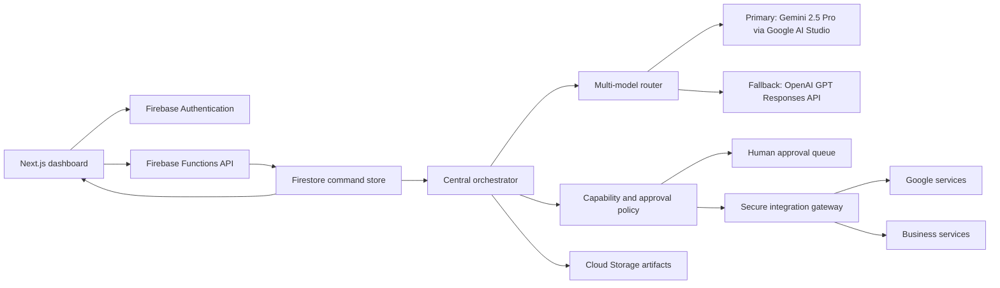

# PageLoom OS architecture

PageLoom is a multi-tenant, event-driven agency control plane. The dashboard never invokes models or third-party services directly. Authenticated commands enter the Functions API, become Firestore work records, and are claimed transactionally by the central orchestrator.

## Runtime boundaries

- `@pageloom/core` contains provider-neutral schemas, all twenty-two versioned single-responsibility agent contracts, the customer-journey state machine, and deterministic routing policy.
- `@pageloom/functions` owns credentials, authorization, orchestration, external side effects, audit records, usage accounting, webhooks, and schedules.
- `@pageloom/web` is a static Next.js application. It reads authorized live projections from Firestore and sends mutations only through the API.
- Firestore stores organization-scoped commands and projections. Cloud Storage stores generated artifacts. Security Rules make browser data effectively read-only.

## Agent fleet

CEO, Sales, Client Journey, Project Manager, Website Architect, UI/UX Designer, Frontend Builder, Backend, Firebase, SEO, Content, Brand, Media, QA, Deployment, Maintenance, Support, Marketing, Finance, Analytics, Automation, and CRM agents share one typed result contract. Responsibilities do not overlap. Only the orchestrator may execute tools or create child tasks.

## Human-first business boundary

Agents may prepare sales intelligence, but no agent calls, messages, or closes a prospect. Only an organization owner can create a project, and the request must contain a CRM lead ID plus close evidence. That atomic transaction records the human close and queues post-close intake. Both the API and orchestrator reject project work without `dealClosedAt`.

## Reliability and scale

Task claims use Firestore transactions. Tool executions use organization-scoped idempotency keys. Trigger retries, maximum delegation depth/count, structured outputs, local schema validation, provider fallback, webhook deduplication, immutable activity records, and approval state machines prevent silent or duplicate work. Functions and Hosting scale independently on Google Cloud.
