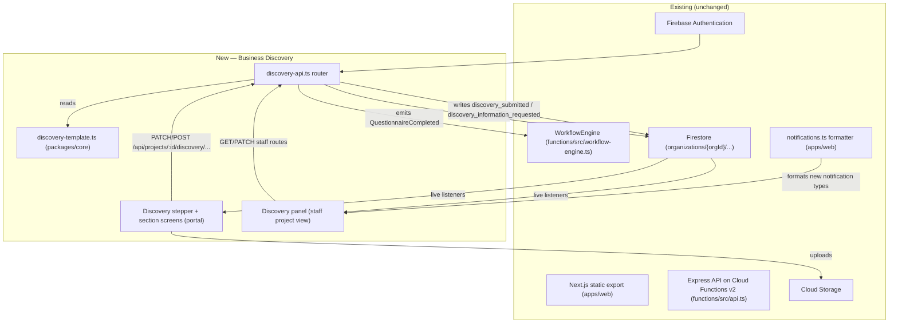

# Business Discovery — Architecture

Companion to [`PRD.md`](./PRD.md) and [`DATA-MODEL.md`](./DATA-MODEL.md).

## 1. Where this fits in the existing system



No new Firebase project, no new Cloud Function *type* (still one HTTPS Express app), no
new Hosting target, no new region. `discovery-api.ts` is mounted exactly like
`onboardingJourneyRouter` (`app.use("/api", discoveryRouter)`), inheriting the same
global `authenticate` middleware, rate-limit wiring, and security headers already applied
to every other route in `functions/src/api.ts`/`functions/src/index.ts`.

## 2. New files (planned; created during implementation, not by this PRD)

| File | Purpose |
|---|---|
| `packages/core/src/discovery-template.ts` | Section/question definitions, `isQuestionVisible`, `missingRequiredDiscoveryFields`, `SemanticTag` enum |
| `packages/core/src/discovery.ts` | Zod schemas for API payloads (`saveSectionSchema`, `completeSectionSchema`, `submitDiscoverySchema`), `BusinessProfileDocument` type |
| `packages/core/src/discovery-template.test.ts` | Unit tests for conditional logic, validation, progress math |
| `functions/src/discovery-api.ts` | Express router: save/complete/submit/reopen/note endpoints |
| `functions/src/discovery-api.test.ts` | Route-level tests (matching `onboarding-journey-api.ts`'s existing test file's style, if one exists, or `closing-api.test.ts`'s) |
| `apps/web/src/lib/i18n/dictionaries/discoveryQuestions.ts` | Question copy (label, whyWeAsk, helpText) per locale |
| `apps/web/src/lib/i18n/dictionaries/discoveryShell.ts` | Shell copy: stepper labels, save-status words, completion screen |
| `apps/web/src/components/discovery/DiscoveryStepper.tsx` | 9-step rail, reused visual pattern from `customer-journey-timeline.tsx`/`workflow-timeline.tsx` |
| `apps/web/src/components/discovery/DiscoverySection.tsx` | Renders one section's questions + autosave wiring |
| `apps/web/src/components/discovery/DiscoveryQuestionInput.tsx` | Per-type input renderer, extends `QuestionnaireInput`'s type-switch pattern with the 5 new types |
| `apps/web/src/components/discovery/FileUploadField.tsx` | Shared resumable-upload component (see `PRD.md` §14; used by `file`/`file_repeater`) |
| `apps/web/src/components/discovery-panel.tsx` | Staff-side Discovery card, added to `projects/view/page.tsx`'s onboarding tab alongside `OnboardingJourneyPanel` |
| `apps/web/src/lib/hooks/useFileUpload.ts` | Shared `uploadBytesResumable` progress hook, replacing ad hoc `uploadBytes` call sites for this feature (existing call sites elsewhere are not touched — see `PRD.md` §14) |

No existing file is deleted. `apps/web/src/app/(product)/portal/page.tsx` gains a new
Discovery entry point alongside (not replacing) `CustomerQuestionnaire`, since the
Website Brief mechanism keeps working for any project still using it (`PRD.md` §33).

## 3. Workflow engine integration — the one place this must be exact

`WorkflowStage` (`packages/core/src/workflow.ts:4-9`) is unchanged. Business Discovery
occupies the existing `onboarding → questionnaire → assets` span:

```
payment_confirmed --(OnboardingStarted, manual, owner-only)--> onboarding
onboarding --(OnboardingCompleted, automatic)--> questionnaire
questionnaire --(QuestionnaireCompleted)--> assets      <-- Discovery's exit point
assets --(AssetsValidated)--> research
```

Today, `onboarding-journey-api.ts`'s `POST /projects/:id/payment-confirmed` handler
synchronously drives `PaymentConfirmed → OnboardingStarted → OnboardingCompleted` and
**also** auto-creates the Website Brief questionnaire in the same request. The one change
to that handler: instead of (or in addition to, per the open decision in `PRD.md` §37)
auto-creating a Website Brief questionnaire, it initializes `discoveryProgress/current`
with `status: "not_started"` and `templateVersion: DISCOVERY_TEMPLATE_VERSION`.

`POST /projects/:id/discovery/submit` (new, in `discovery-api.ts`) is the functional
replacement for the existing `POST /projects/:id/questionnaires/:id/complete`'s
`kind==="website_brief"` branch: after validating every required, currently-visible
question across all 9 sections is answered (`missingRequiredDiscoveryFields` per
section), it:

1. Sets `discoveryProgress.status = "submitted"`, `submittedAt`.
2. Calls `WorkflowEngine.emit()` with a `QuestionnaireCompleted` event for the project —
   **the exact same event type** the Website Brief path already emits, so
   `resolveWorkflowTransition`, `assets/validate`, and everything downstream needs zero
   changes.
3. Writes a `discovery_submitted` notification (owner audience) — see `PRD.md` §15.
4. Appends a `discovery_submitted` activity record (`SECURITY.md` §7).

This is a **direct extension of the file's own established pattern** (auto-create →
drive workflow → notify), not a new architectural idiom.

## 4. Assets/materials — deliberate non-goal

The existing `assets` workflow stage's exit condition
(`POST /projects/:id/assets/validate`) validates file paths under the
`organizations/{orgId}/questionnaires/{projectId}/` prefix (see `DATA-MODEL.md`'s sibling
audit finding). Business Discovery's stage-7 "חומרים ותמונות" uploads live under a
**different** prefix (`organizations/{orgId}/discovery/{projectId}/materials/...`, per
`PRD.md` §14) and are **not** what `assets/validate` checks — that endpoint's contract is
intentionally left untouched (`PRD.md` §33, "zero changes downstream"). This means: after
Discovery submission, staff still separately runs the existing `assets/validate` flow
(pointing at whichever file paths are the actual build-ready asset set — today,
questionnaire paths; the natural evolution is for staff to instead reference
Discovery's stage-7 materials paths) to advance `assets → research`. **This PRD does not
change `assets/validate`'s accepted-path-prefix logic** — doing so is a one-line change
(`allowedPrefix` in `functions/src/api.ts`) but is explicitly deferred to
`IMPLEMENTATION-PLAN.md` Phase 6, since it changes an existing, tested endpoint's
behavior and deserves its own reviewed diff rather than being folded silently into
Discovery's initial build.

## 5. Notification producer

Following the existing pattern exactly (`onboarding-journey-api.ts`'s local `notify()`
helper, §"Notifications system" in the audit) — `discovery-api.ts` defines its own scoped
`notify(organizationId, doc)` helper rather than importing another file's private
helper, consistent with how every other router in this codebase does it today (no shared
notification-writer utility exists yet; introducing one is out of scope for this
feature — see `PRD.md` §35 risks table).

## 6. What does not change

- `firestore.rules`' helper functions (`staff`, `privileged`, `client`, `clientProject`,
  `clientProjectList`, `platformAdmin`) — reused verbatim, new `match` blocks only.
- `storage.rules`' `safeUpload()`/`safeUploadShape()` — reused verbatim for `file`/
  `file_repeater` uploads; no new global upload ceiling introduced.
- `functions/src/auth.ts` — zero changes; `requireRole`/`requireProjectAccess`/
  `customerPermission` cover every access pattern Discovery needs.
- CI (`ci.yml`) — no new job type; new tests run inside the existing `npm test`/
  `npm run test:behavioral` invocations.
- `firebase.json` — no new rewrite, no new emulator port, no new predeploy step.
